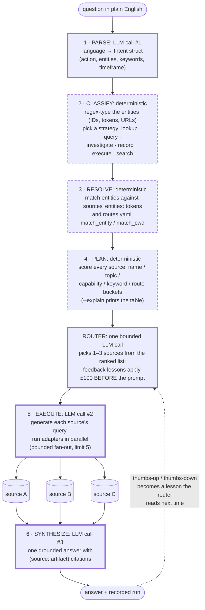

My grandmother was a telephone operator. You picked up the handset, told her who you wanted, and she plugged a cord into the right jack on the board in front of her. She did not guess and she did not improvise. The directory was on the desk, on paper, and when a call landed at the wrong house somebody could read the paper and see why. There were two jobs in that chair, and they were nothing alike: understanding the caller, the mumble, the panic, "the doctor, the one on Elm, hurry," was the hard, human part, and deciding which jack got the cord was a lookup. That second job was never supposed to be creative.

In [part 1](/posts/aida-part-1-an-agent-of-agents-for-one-person/) I told you I built a butler, and I left it at "mostly magic." This part opens one panel of the machine, and it turns out the whole trick is the switchboard: **the AI understands the question, but a rulebook I can read decides where to look.**

## Everyone gets this backwards

Here's the thing about most agent frameworks: they hire the world's most eloquent switchboard operator and then let her plug cables in wherever she feels like. You give the model a list of tools and say "you figure it out." And it does figure it out, most of the time, the way a very confident intern figures things out. Ask the same question Tuesday and Thursday and it may look in two different places. Ask why it searched your email for a question about a database and the honest answer is: nobody knows, the weights were feeling email-ish that day. When it fails, there is nothing to read.

**You can't diff a vibe.**

For a demo, fine. For a system that answers questions about my actual life twenty times a day, that's dumb. I don't mean the models are dumb, they're spectacular at exactly two things in this pipeline, and I'll get to those. I mean letting the model make the routing decision is dumb, the way it would be dumb to let the operator improvise the phone directory from memory each morning.

So Aida's core design bet, the one I stated in [part 1](/posts/aida-part-1-an-agent-of-agents-for-one-person/) without proving: **LLM at the edges, deterministic middle.** The model translates language in and prose out. Everything between is configuration: files I can read, edit, and blame.

## The rulebook is a folder of files

Every place Aida knows how to look, a codebase, a folder of documents, a database, a command-line tool, is one YAML file in a library folder. Here's a complete, working one, for a fictional client I'll call pym-tech (any resemblance to shrinking-related enterprises is affectionate):

```yaml
# ~/.aida/library/sources/pym-tech-docs.yaml
path: ~/clients/pym-tech/docs
type: docs
description: pym-tech contracts, invoices, and meeting notes
capabilities: [entity-docs]
entities: [pym-tech]
search:
  mode: grep
  include: ["*.md", "*.txt"]
```

That's it. That's how Aida learns a new place to look: I write a file. No plugin API, no code, no redeploy. The `entities:` line does most of the routing work, and you'll see why in a minute. The rulebook gets linted too: a validator runs at load time and rejects any source whose command template would hand the model's raw text straight to a shell, because I tried that once, and a language model will eventually emit prose where you wanted a command. The directory is paper. Paper can be proofread.

## One question, six steps, three model calls




Let's trace an actual question through the machine. Say I ask:

```
aida "what's the refund status on the pym-tech invoice from Tuesday?"
```

Six steps happen, and exactly three of them talk to a model. **Parse** (model call #1). Natural language becomes a small structured record: the raw entities it spotted (`pym-tech`), an action (`lookup`), keywords, a timeframe if I mentioned one. This is the operator hearing you, and it's the thing LLMs are genuinely magic at.

**Classify** (no model). Plain pattern matching types each entity: a structured code matches one token shape, a long ID another, a URL another, a plain word like `pym-tech` its own bucket. Then a strategy gets picked: a simple lookup, a parallel fan-out, a multi-step investigation. Regexes. Deterministic. Boring is the point.

**Resolve** (no model). Resolve used to be the fanciest part of the machine: an entity registry mapping raw tokens to real clients by alias. That registry is gone now. It only ever served one client, and generalizing is the whole point of writing any of this down. What's left is plainer, and I like it better: a source names itself in its own `entities:` list, a route can say the same thing in `routes.yaml`, and resolve's whole job is to hand the raw entity `pym-tech` downstream as a plain string, nothing decoded, nothing looked up. If that string shows up in either place, the connection is made. The operator isn't consulting a card file of aliases anymore, she's matching the word on the slip to the word on the folder.

**Plan** (no model). Every source in the library gets a score against the question: points for a name match, points for capability fit, points for keyword overlap, points for topic overlap when a word matches a source's own `entities:` list, and, when a `routes.yaml` rule fires, a route boost stacked on top. The route boost is +100, and it dominates the table. A name match, the strongest thing one source can do for itself, is +30. A route outscores three of those, because a route isn't one source arguing its own case, it's the config file itself saying "these sources, together, for anything about pym-tech." And you can watch it: `--explain` prints the scoring table, and it looks like this (lightly trimmed):

```
$ aida "what's the refund status on the pym-tech invoice from Tuesday?" --explain

Planner scoring (9 candidates, 2 picked)
  score  source           name  topic  cap   kw  type  route  picked
  -----  ---------------  ----  -----  ---  ---  ----  -----  --------
  108    pym-tech-docs       0      8    0    0     0    100  → lookup
  105    billing-db          0      0    5    0     0    100  → lookup
  8      home-wiki           0      8    0    0     0      0
  5      web-search          0      0    0    5     0      0
  ---  zero-score (considered, cut)  ---
  0      minecraft-server    0      0    0    0     0      0
```

Every routing decision, as arithmetic, with a paper trail. When Aida looks somewhere weird, I don't interrogate a neural network about its feelings. I read the table, find the score that shouldn't have won, and fix a YAML file. **Execute** (model call #2). The model comes back on stage for the second thing it's great at: speaking each source's local dialect. It writes the actual grep pattern, the actual SQL, the actual API query, per source, and the sources run in parallel, because Go makes firing five queries at once embarrassingly easy.

**Synthesize** (model call #3). All the results come home and the model writes one answer, with citations pointing back at the sources, receipts included, like the Cape Cod query in [part 1](/posts/aida-part-1-an-agent-of-agents-for-one-person/) that flagged its own count as suspicious.

Language in, language out. Everything in between is a spreadsheet with opinions.

> **Techy tidbit:** Three core model calls per query (parse, execute, synthesize) plus one bounded router call: after deterministic planning, the top candidates (capped at twelve) go to a small LLM pass that picks the final one-to-three sources, with the deterministic scores as priors it has to argue against. Same question plus same config equals same plan, which is what makes the pipeline testable. Rationale and diagram: `docs/notes/technology-rationale.md`, `docs/diagrams/pipeline.md`. If you've read Anthropic's ["Building Effective Agents"](https://www.anthropic.com/engineering/building-effective-agents), this is their "use workflows, not agents, when you can" argument taken personally. The parallel fan-out came from watching [LangChain](https://www.langchain.com/); what I left behind was the part where the model decides everything.

## Corrections that actually stick

Here's a thing that drives me crazy about chat assistants: you correct them, they apologize beautifully, and tomorrow they do the same thing. The correction goes nowhere. It's the goldfish apology loop. Aida's corrections are load-bearing, though: when it routes a question badly, I tell it off, in English:

```
aida thumbs-down --because "no need for github, should have used the home wiki"
```

A little parser (deterministic, naturally) walks that sentence tracking polarity. "No need for github": *github* lands in the excluded list. "Should have used the home wiki": *home-wiki* lands in the intended list. It handles negations and flips ("don't use X, use Y", "Y instead of X"), because people grumble in compound sentences.

That directive gets stored as a *lesson*, along with a mathematical fingerprint of the question I asked (an embedding, think GPS coordinates for meaning). The next time I ask something *similar*, not identical, similar, the router finds the nearest past lessons and applies them as score adjustments: +100 to the source I said I wanted, -100 to the one I banned. Before the model sees anything.

That last bit is the design lesson I'd tattoo somewhere visible: **the model may ignore a hint, but it cannot ignore arithmetic.** Early on, corrections went into the router prompt as prose: "note: the user previously preferred the wiki for questions like this," and the model would nod along and then pick the wrong source anyway, reasoning its way right past my correction like a toddler negotiating bedtime. Moving the correction out of the prose and into the scores was the moment feedback started sticking. I complain once, the rulebook rewrites itself, the machine behaves differently on Thursday because of what I said on Tuesday. That compounding is the point of the whole project, and it's where part 3 is headed.

> **Techy tidbit:** Lessons live in SQLite with their embeddings; at routing time the top-3 most-similar thumbs-down lessons contribute deterministic ±100 adjustments to the candidate scores before the router prompt is built. The magnitude started at ±50, but a -50 demotion couldn't dislodge a source with a +100 route boost; the model kept flipping back to the old favorite on prose reasoning. Full mechanics: `docs/notes/feedback-mechanics.md`.

## The week the cache lied about the time

Every system that learns eventually learns something wrong, so here's this part's confession, verified against the git history because my memory flatters me. In July I built a shortcut: before running the whole pipeline, check whether I've asked essentially this question before, and if a past run answered it well, serve that answer instantly. A repeat-question cache. Shipped in a day, felt fantastic. Some questions came back in under a second.

**Symptom:** a revenue question (the fictional version is "what did pym-tech invoice this week?") came back instantly, confidently, with citations. And the number was last week's. No warning, no staleness flag. Just a wrong answer wearing a nice suit.

**Wrong hypothesis:** the similarity matching must be broken, it's matching questions that aren't actually the same. And I'd earned that suspicion honestly: the matching genuinely had been broken on launch day, fingerprints for questions and fingerprints for stored entries computed in two different "dialects," fixed within hours. So I went hunting for another fingerprint bug.

**Actual cause:** the matching was working perfectly. That was the problem. "What did pym-tech invoice this week?" is the same *sentence* every week (near-identical fingerprint), but it's a different *question* every week. The cache stored sentences and I was asking it about time. No amount of similarity tuning fixes that, because the two questions really are similar. They're just not equal, and the difference lives in a word the fingerprint barely notices.

**Fix**, two days later, three rules: time-sensitive questions ("this week," "yesterday," and, second pass, the sneaky backward-looking ones like "year to date") are refused at admission, so they never enter the cache at all; everything else gets a 30-day expiry as a backstop; and each entry is stamped with when its answer was originally computed, not when it was cached. The cache stayed. It just stopped taking questions it couldn't honestly hold.

The moral isn't "caches are hard," although, yes. The moral is that in a deterministic middle, even the bugs are boring, and boring bugs are a luxury. Nobody had to ask the model why it was feeling like last week.

> **Techy tidbit:** The regression test for that fix is a golden: an eval harness replays a seed set of questions with graded routing expectations (it started as a 40-question routing audit, one expected source each, plus a tighter in-repo suite that asserts routing and answer together). A config change that silently re-breaks routing fails like a unit test, because where-it-looked is deterministic. Seed set: `examples/golden/`. War stories: `docs/notes/failure-stories.md`.

## Paper directory, human operator

So that's how it decides. A model that understands, a scoring table that chooses, YAML files that anyone, including me, six months from now, at 11pm, can read and fix. The operator's directory had one more property: it got updated. New families moved to town, the doctor retired, the paper changed to match. Aida's rulebook updates too, every thumbs-down rewrites it, and how that memory accumulates without turning into a junk drawer is part 3: How it remembers.

Still magic. Just wired.
