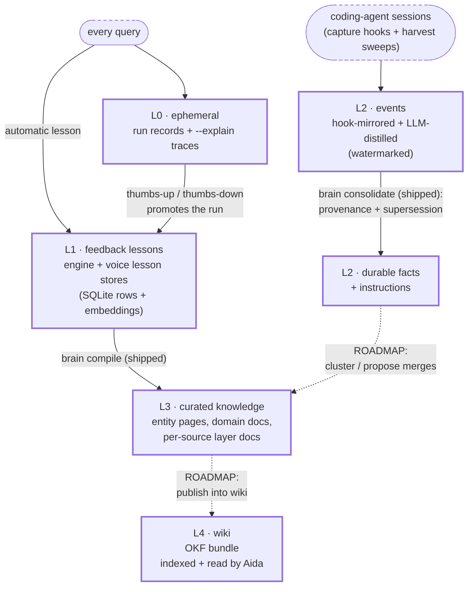

## The 413-megabyte goldfish

One afternoon last July I decided to audit my AI assistant's memory. Not philosophically. Literally, with `du`.

```
$ du -sh ~/.claude
413M    ~/.claude
```

Four hundred and thirteen megabytes of working sessions, preferences, project context, and hard-won corrections, and none of it was backed up. Not a git repo, not a dotfiles setup, not iCloud. It lived on exactly one disk, one spilled coffee away from amnesia. So I sorted through it, braced for a painful triage, and it wasn't painful at all. The part that was actually irreplaceable, the rules, the preferences, the distilled knowledge, the stuff that makes it mine, came to about fifty kilobytes. The other 412.95 megabytes was session transcripts, caches, and image thumbnails, all of it regenerable. **The valuable part is tiny and nobody is keeping it.**

That ratio is the whole story of AI memory right now. You spend forty minutes teaching a chat window who you are, what your project does, and why the staging database is cursed, then you close the tab and tomorrow it's a goldfish. Every conversation starts at zero, and the industry's answer is to sell you a bigger context window, which is like solving amnesia with a wider whiteboard. This is dumb. Humans solved this problem several thousand years ago, and the solution is called writing things down.

## One brain, many mouths

[Part 2](/posts/aida-part-2-how-it-decides/) was about how Aida decides where to look. This part is the other half of the bet: everything worth keeping gets written down in one place, and everything I run can read from it. The rule is simple to state. Every AI session I have, Claude Code in a terminal, Codex in another terminal, Gemini in a third, even the notes and summaries from my own work meetings, gets distilled into one memory store, which I call the brain because I am not a creative man. Every tool gets to recall from it. Ask the voice assistant something and it can surface a decision I made in a coding session three weeks ago. The knowledge stops evaporating when the terminal closes.

The interesting part isn't the ambition. Everyone wants this; there are a dozen "agent memory" startups selling it. The interesting part is two design decisions that made it actually work for one person on one laptop, and one embarrassing bug that taxed me ten seconds per question for four days. We'll get to the bug.

## Files are the truth. The database is a card catalog.

Decision one: the brain is a git repository full of markdown and small JSON files. That's it. That's the database. **Files are the truth. The database is a card catalog.** There is also a real database, a SQLite file with embeddings in it, so "what did I decide about retries" finds the right memory by meaning instead of by keyword. But that database is an index, never the truth. Think of a library: the books are the truth, the card catalog just helps you find them. If the card catalog burns down, you have lost nothing. You rebuild it by walking the shelves.

`aida brain index` is the walk-the-shelves command. The SQLite file is disposable by design, and everything downstream gets simpler because of it:

- I can read my own memory. It's markdown, so I can open it, edit it, delete the wrong parts, and `git log` my own knowledge.
- Backup is `git push` to a private repo, because the brain commits itself after every query.
- A new machine is a clone plus an index rebuild. No export format, no migration tool. The one thing several machines can fight over is a counter, and I hit that this week: two laptops each handed out task #480. The fix landed today and it is the files-as-truth rule again: before a machine assigns a task number it pulls the repo, re-reads every task file on disk, and reseeds the counter from what it finds, so the files win and the database catches up.
- Nobody owns it but me. My memory is markdown in a git repo, not a vendor's database.

If you take one idea from this post, take that one. It's not clever. That's why it works.

## Two ways a memory gets in

Decision two took longer to figure out: how does anything get into the brain without me spending my evenings as a librarian? It turns out there are exactly two shapes of problem. Shape one: the tool already writes things down. Claude Code deliberately maintains memory files. When it learns something durable about me or a project, it writes a small markdown file saying so. That's a gift. A capture hook mirrors those files into the brain the moment they're written. No AI involved, no judgment call, just a copy with the labels sorted out. I call this the mirror.

Shape two: the tool writes nothing down, but leaves a mess. Codex and Gemini don't author memory files. What they leave on disk is a raw transcript: thousands of lines of tool calls, half-finished reasoning, both of us muttering at a stack trace. Somewhere in there might be two sentences worth keeping forever.

So for these, the brain runs a harvester. When a session has gone quiet for ten minutes, meaning I've actually stopped, not paused for coffee, a model reads the transcript and answers one question: is there anything here a future session would want to know? It's allowed to propose up to five durable memories. It's equally allowed to propose zero, and the prompt says so explicitly, because most sessions teach you nothing, and a memory system that manufactures insights to fill a quota is worse than no memory system at all.

A distilled memory is small and boring on purpose. Here's what one looks like, fictional project, real shape:

```json
{
  "type": "fact",
  "profile": "codex",
  "key": "staging-db-resets-nightly",
  "tags": ["project:damage-control"],
  "body": "The damage-control staging database restores from
           Sunday's snapshot every night at 2am. Anything written
           there evaporates by morning. Test data must be reseeded,
           not assumed."
}
```

Two sentences that would otherwise have been rediscovered, painfully, in some future session. Now they're recallable from any tool:

```
$ aida brain recall --profile codex "staging database"
```

The same harvester handles my meeting notes, with one extra trick: a glossary file of proper nouns, because speech-to-text turns names into oatmeal. It once transcribed me as "Owens." The glossary corrects the names before anything gets written down, so the brain remembers people, not phonetic accidents.

> **Techy tidbit:** Before any model sees a question, a regex layer decides what kind of memory it wants. One pattern flips recall from nearest-by-meaning to newest-by-date when the question reads as a recency request (`\b(last|latest|newest|recent|recently)\b`). Another gates recall in at all, so a plain codebase question never pays for an embedding lookup it doesn't need:
>
> ```
> (?i)\b(what do you (know|remember)|what did (i|you) (say|save|tell|note|mention|build|make|create)|
>       do you remember|did i (tell|mention|say|ask|build|make|create|set up|write|add)|
>       my (preference|note)s? (on|about|for)|(last|latest|newest) (claude )?memory|remind me what)\b
> ```
>
> There are more of these at the front door: a time-sensitive pattern ("this week", "yesterday", "year to date") that keeps a question out of the repeat-answer cache, and a news-and-weather pattern that routes "headlines" and "is it raining" to live sources before anything is scored. Regexes are unfashionable, and they are also free, instant, deterministic, and diffable, which is the whole argument of [part 2](/posts/aida-part-2-how-it-decides/) applied to memory. The harvester behind them is a watermark plus a quiet window: each tool keeps a bookmark file in the brain repo saying "harvested through this timestamp", a session touched in the last ten minutes is treated as still running, transcripts are trimmed to roughly the first and last 15,000 characters since the middle of a long session is the least informative part, and every record writes through one path that supersedes by key, so relearning a fact replaces it instead of duplicating it. Hooks on the coding tools' stop events trigger harvests; a periodic sweep in the daemon catches what the hooks miss. Design notes: `docs/claude-memory-bridge-design.md` and `docs/memory-bridge-multi-agent.md`.

## The tiers

### The map: five levels, five shelves

Before the flow, the map. Five levels, each with a shelf in my kitchen, and none of the ideas original to me. The lineage runs from memory-consolidation research through a couple of agent frameworks to the way your own head works, and I have tried to say which is which.

<table class="levels">
<thead><tr><th>Level</th><th>What it holds, and how often it changes</th><th>Kitchen shelf</th><th>Borrowed from</th></tr></thead>
<tbody>
<tr><td>L0, ephemeral</td><td>run records and <code>--explain</code> traces; a new one every query</td><td>receipts in a drawer</td><td>plain logging; sensory memory in the human brain, gone in seconds unless something flags it</td></tr>
<tr class="example"><td colspan="4"><pre><code>aida "how many times did I go to Cape Cod in 2023 and 2024" --explain
aida runs        # the receipt: sources consulted, model calls, cost</code></pre></td></tr>
<tr><td>L1, feedback lessons</td><td>thumbs-up and thumbs-down corrections with an embedding of the question; changes whenever I complain</td><td>sticky note on the fridge</td><td>LangChain's <a href="https://blog.langchain.com/your-harness-your-memory/">"Your harness, your memory"</a>: the harness owns behavior corrections, not the model</td></tr>
<tr class="example"><td colspan="4"><pre><code>aida thumbs-down --because "no need for github, should have used the home wiki"
# next similar question: home-wiki +100, github -100, before the model sees anything</code></pre></td></tr>
<tr><td>L2, captured agent memories</td><td>what the mirror and the harvester pull out of every coding session, per tool; changes a few times a day</td><td>session notes in a pile</td><td><a href="https://arxiv.org/abs/2310.08560">MemGPT</a>'s idea that an agent should page durable facts out of its context window; working memory becoming short-term memory</td></tr>
<tr class="example"><td colspan="4"><pre><code>aida brain harvest --tool codex
aida brain recall --profile codex "staging database"</code></pre></td></tr>
<tr><td>L3, curated knowledge</td><td>one page per entity or domain, revised deliberately; changes when I sit down and edit</td><td>the notebook of recipes we make</td><td>Karpathy's <a href="https://gist.github.com/karpathy/442a6bf555914893e9891c11519de94f">LLM-maintained wiki</a>; the hippocampus writing episodes into cortex during sleep</td></tr>
<tr class="example"><td colspan="4"><pre><code>aida brain search "pym-tech contract dates"
$EDITOR ~/.aida/brain/entities/clients/pym-tech.md   # it is a file; edit it</code></pre></td></tr>
<tr><td>L4, consolidated wiki</td><td>promoted, deduplicated knowledge that fades when it stops being true; changes rarely, and only by promotion</td><td>the cookbook</td><td><a href="https://www.elastic.co/search-labs/blog/agent-memory-elasticsearch">Elastic's Atlas</a>: episodic-to-semantic promotion with decay scoring, which is also how long-term memory is thought to consolidate and forget</td></tr>
<tr class="example"><td colspan="4"><pre><code>aida brain consolidate   # promotes events into facts with provenance (partly built, still the roadmap)
aida "what did CoachView do and when did it wind down"
# CoachView.io, the multi-tenant coaching SaaS I built and ran from the 2010s to 2020: forms,
# drip sequences, landing pages, billing. None of that will ever change again. That is what L4 is for.</code></pre></td></tr>
</tbody>
</table>

Read the second column top to bottom and you get the other rule of the stack: the higher the level, the slower it changes. L0 churns on every question. L4 moves a few times a month, and only when something below it has earned the promotion. That gradient is what makes the top trustworthy. Anything that changes every five minutes cannot be a source of truth, and anything that never changes is a museum.

The physiology column is an analogy, not a claim. Nobody's SQLite file is a hippocampus. But the shape that neuroscience describes, a fast volatile layer feeding a slower durable one through a consolidation pass that keeps what gets used and lets the rest fade, is the shape Atlas describes, the shape OpenViking arrived at, and the shape this brain has. When three unrelated groups converge on a design, the design is probably not the clever part.

### The flow: how memory is written and promoted

The diagram below is the same five levels drawn top to bottom. Solid arrows are working code today. Dotted arrows are the two promotion paths still on the roadmap. Decay is not a path between tiers: during agent recall, it lowers the ranking of stale knowledge without moving or deleting the record.



Not all memory deserves the same shelf. My kitchen has receipts in a drawer, a sticky note on the fridge, a pile of recipe printouts, and one battered notebook of recipes we actually make. Same information lifecycle, wildly different levels of trust. The brain works the same way, in five tiers:

- **Receipts.** Every query leaves a run record: what was asked, what was consulted, what it cost. Debugging material, and nobody reads old receipts unless something went wrong.
- **Sticky notes.** When I thumbs-down an answer and say why, that correction becomes a lesson with real teeth. [Part 2](/posts/aida-part-2-how-it-decides/) covered how lessons mechanically change routing; a correction is memory too, just memory about behavior.
- **Session notes.** Everything the mirror and the harvester capture: plentiful, automatic, individually small.
- **The notebook.** Curated pages, one per entity or domain I actually care about, written and revised deliberately: fewer, denser, trusted.
- **The cookbook.** The long-term wiki, maintained separately today and indexed by Aida for recall. Publishing curated knowledge into it automatically is still the roadmap.

Some of that commuting is already automatic. A thumbs-down turns a receipt into a sticky note the instant I give it; harvest sweeps turn sessions into typed memories on a timer; consolidation promotes short-lived events into durable facts or instructions; and the lesson compiler writes accumulated routing wisdom into curated knowledge. The last two crossings are not built yet: clustering L2 memories into L3 pages, then publishing L3 into the wiki. Decay is quieter than the old diagram implied. It changes what recall ranks highly, using age and use count, but never moves or deletes the underlying record. My job is to curate exceptions while the shipped parts of the pipeline do their commuting.

## The 10-second tax

Time for the confession. Every part of this series carries one story of something going wrong, because failure write-ups are the only part of engineering blogs anyone fully trusts. The brain shipped on April 11th, and almost immediately, every single question got about ten seconds slower. A spinner would appear, "Rebuilding brain index...", and grind for ten-plus seconds, and then the actual answer would come back fine.

My hypothesis, to the extent I had one, was that's just what a brain costs. Embeddings are slow. Indexes need maintaining. The answers were good, the spinner looked productive, and I had just bolted a memory system onto the thing. Of course it was slower. I paid the tax on every question for four days without seriously questioning it. The launch notes for this series originally said "weeks." I checked the git history while writing this post: four days. It felt like weeks, which tells you something about ten-second waits.

The actual cause was a beautiful little self-own. After every answer, the system records a lesson: a small JSON file, written to the brain. The staleness check for the index was one line of logic: if any file is newer than the database, rebuild the database. But recording a lesson also inserted it directly into the database. The file wasn't stale at all; the index already knew everything the file said. So the sequence went: answer a question, write a lesson file, and the next question would find a file newer than the index, declare the whole thing stale, and re-embed the entire brain from scratch. Every query paid ten seconds to rebuild an index that was already correct. The system was punishing itself for learning: the more it learned, the more it paid.

The fix was two lines of humility. First, don't treat one or two newer files as staleness, that's just the current session doing its job; only rebuild when three or more files are newer, which means something bulk actually happened, like a `git pull` bringing another machine's lessons in. Second, touch the database's timestamp after every rebuild so it stops losing the race with its own output. Later, rebuilds moved into a detached background process entirely, so even a genuinely stale index costs the current question under a second while the rebuild happens off to the side.

**The staleness check is the design.**

It generalizes to anyone building files-as-truth systems, which is why I'm telling it. The moment your database is derived, the check that decides when to trust it deserves the same care as the schema. Get it wrong paranoid and you rebuild constantly, paying on every read. Get it wrong lazy and you serve stale answers, which is worse. Mine got neither, for four days.

## Someone else built the same thing

In January 2026, ByteDance open-sourced a project called OpenViking, a "self-evolving context database for AI agents." It collected 33,000 GitHub stars in about eight months. I found it in August, read the README, and had the genuinely strange experience of reading my own design decisions back at me, with better retrieval science and a Rust engine underneath.

They organize all agent context as a navigable filesystem instead of an opaque vector store. Agents browse it with `ls` and `find`. They distill sessions into durable memory asynchronously after the session ends. They summarize at write time into tiers, so retrieval loads only as deep as it needs.

Files as the paradigm, distillation over hoarding, tiered memory. A team in Beijing and a guy in a home office converged on the same shape, independently, because the shape is apparently just what this problem wants. Convergent evolution is the strongest design validation there is, much stronger than me telling you my architecture is good.

The differences are just as instructive. OpenViking is a service: a Python daemon with a Rust core that your agents integrate with through an SDK or plugin. Every tool has to cooperate. Aida's brain is a git repo of markdown plus a harvester that reads transcripts other tools were already leaving on disk, zero cooperation required. When a tool doesn't know your memory system exists, it can't break the integration. And I can read my store with `less`; theirs is a database.

Worth saying too: OpenViking's core is AGPL, a real license with real obligations if you build a service on top of it. One more reason "just use theirs" was the wrong answer for a project meant to stay a pile of files anyone can fork.

The idea I'm openly stealing from them: write-time tiered summaries, so each memory carries a hundred-token abstract alongside its full body, and recall can pack far more context per token. It's on the roadmap, with credit.

> **Techy tidbit:** One naming collision to defuse: OpenViking's L0/L1/L2 are three summary depths per record, roughly a 100-token abstract, a 2,000-token overview, and the full content. My L0 through L4 are lifecycle tiers across records. Orthogonal ideas, and combining them is exactly the roadmap item above. Their directory-recursive retrieval, ranking directories first and then drilling down, is the other idea worth borrowing, since the brain already has a directory hierarchy to exploit.

OpenViking wasn't the only one. On April 5, 2026, Garry Tan open-sourced [GBrain](https://github.com/garrytan/gbrain), the memory behind his own agents, and its README could be a summary of this post: "Your knowledge lives in a regular git repo as markdown files," with a database that syncs from the repo for retrieval and is never the truth. I had been sketching Aida's brain since January and shipped it on April 11, six days after his came out, without having seen it. Nobody copied anybody. Two people who both wanted an agent to remember them spent the same spring reaching for git and markdown, which tells you the pattern was lying on the ground waiting to be picked up. Where we part ways is the index and the machinery around it. GBrain syncs into Postgres with vector search, a reranker, and a fleet of enrichment jobs, and it can import an Obsidian vault or a Notion export on the way in. Mine is one SQLite file rebuilt from the folder, one embeddings provider, no jobs, and the folder is the whole thing. His is a memory service you run. Mine is a directory you `cd` into. For one person on one laptop that gap is the feature, and for someone with a hundred and fifty thousand pages his choices are the right ones.

None of this is invented here, and the lineage matters. Episodic-to-durable promotion and decay scoring trace to the memory-consolidation research I credited in [part 1](/posts/aida-part-1-an-agent-of-agents-for-one-person/), Elastic's Atlas above all. The LLM-maintained-wiki idea is Karpathy's. Agents managing their own memory hierarchy was articulated by [MemGPT](https://arxiv.org/abs/2310.08560) (now Letta) and explored well in LangChain's ["Your harness, your memory"](https://blog.langchain.com/your-harness-your-memory/). What I added is the plumbing discipline: one store, files as truth, harvesters that don't need permission.

## Prompts are memory too

There is one more thing the brain stores that I have not called memory yet, and LangChain's ["The Agentic Operating Model"](https://www.langchain.com/resources/the-agentic-operating-model) whitepaper gave me the vocabulary for it. Their argument is that agent behavior does not live in code, it lives in prompts, rules, and traces, so those have to be versioned, diffed, and audited the same way code is, and a production failure should trace back to the exact prompt that caused it and forward to the fix. Their versioning row says it plainly: traditional software versions code commits; agents version prompts, models, data, tools, and code. Aida gets this almost for free because of the files-as-truth decision. The routing rules are YAML in git. The lessons that adjust routing scores are JSON in git. The per-source context documents the model reads before it writes a query are markdown in git. Every run records which sources were consulted and why, so a bad answer on Thursday has a paper trail back to a rule that changed on Tuesday, and `git blame` works on my assistant's behavior. I did not set out to build what an enterprise whitepaper would later call an audit trail for agent behavior. I set out to be able to read my own rulebook. It turns out those are the same thing.

## What compounding feels like

Here's the payoff, fictional names, real shape. A few weeks back, in a coding session, I decided a project I'll call damage-control should retry failed webhooks with exponential backoff, capped at six attempts, and I had reasons. Last week, in a different tool, on a different machine, I asked why the retry cap was six. The answer came back in seconds, citing the original decision, from a session I'd forgotten having. That's the whole feature. Not artificial intelligence. Artificial continuity. Fifty kilobytes of wisdom, compounding quietly, instead of 413 megabytes of chatter evaporating one closed window at a time. Part 4 is what all that plumbing actually spawned.

Here is the exchange, names swapped, shape exact. The question went through the same front door as everything else:

```
$ aida brain recall --profile codex "why is the damage-control webhook retry cap six"

Recalled 1 memory (semantic):

1. [fact] codex:project:damage-control:webhook-retry-policy  (sim 0.71, 2026-08-22)
   Webhook delivery retries with exponential backoff, capped at six attempts.
   Six covers a 15-minute upstream outage (1s, 2s, 4s ... 32s, then a final
   try at 5 minutes) without hammering a partner that is actually down...
```

And the record it found, the file exactly as the harvester wrote it three weeks earlier, in a different tool, on a different machine:

```json
{
  "id": "20260822-194402117-c81e2f",
  "type": "fact",
  "key": "webhook-retry-policy",
  "body": "Webhook delivery retries with exponential backoff, capped at six attempts. Six covers a 15-minute upstream outage (1s, 2s, 4s ... 32s, then a final try at 5 minutes) without hammering a partner that is actually down. Decided after the 08-21 incident where unbounded retries doubled the queue. Do not raise the cap; add a dead-letter queue instead.",
  "tags": ["project:damage-control", "codex-code"],
  "profile": "codex",
  "source": "codex:session:019910a2-3f6e-7c1d-b6a4-8e2f0d5a9c31",
  "created": "2026-08-22T19:44:02Z",
  "confidence": 1
}
```

Every field in that record is doing a job. `key` is what supersession matches on, so if I change the policy next month the new fact replaces this one instead of sitting beside it. `source` points back at the session it came from. `provenance` is empty because this was written directly, not consolidated from events. And `body` is two sentences and a rule, which is the whole art of the harvester prompt: write down the decision and the reason, not the transcript.

And this is what all of it looks like from the outside. The brain repo's history is mostly the brain talking to itself, one `auto:` commit per query, with an occasional human-shaped commit when a knowledge page gets written. The committer on those is Aida. She has her own git identity.


It adds up.
