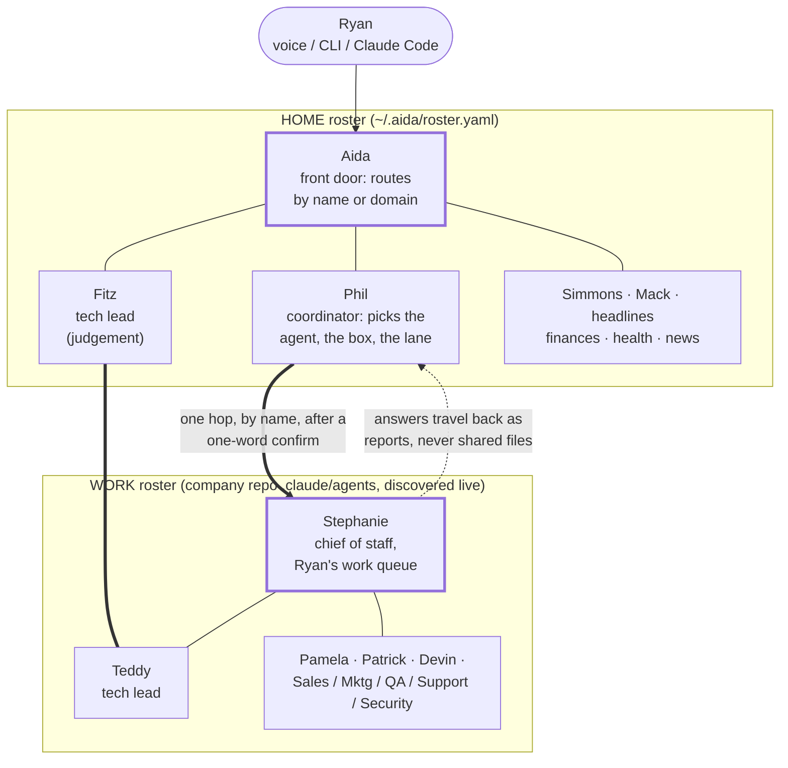
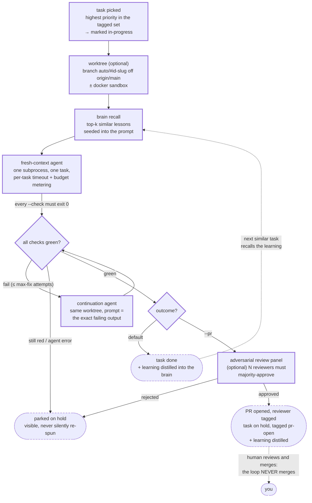

Last Monday I closed a task that had been rotting on my list since April. The task was "update the website with real screenshots," five months old, not hard, just homeless: it was a personal reminder about a company website, so it sat in my personal queue where the company couldn't see it, quietly judging me every time I asked Aida what my day looked like. Here's how it finally died. I told Aida to hand it off, and Aida asked Pamela, the product manager agent on the company side, to write it up. Pamela searched the board for duplicates, found none, filed the ticket with the right labels in the right column, and replied with the issue number. Aida closed my personal task and pasted the ticket number into its body, so future-me knows where the work went. One request out, one report back, two systems consistent, zero shared files. My personal assistant and my company's team of agents shook hands across a seam, exactly once, and both let go.

That handoff is the whole finale in miniature. This series has been about one system I built for myself: [part 1](/posts/aida-part-1-an-agent-of-agents-for-one-person/) said what Aida is, [part 2](/posts/aida-part-2-how-it-decides/) showed how it decides, [part 3](/posts/aida-part-3-how-it-remembers/) showed how it remembers. Part 4 is about the thing I didn't expect: what it spawned.

## Patterns, not products

Here's the claim, and you're allowed to disagree with it. **AI leverage is not a model you rent. It's a loop you own.** Anyone can rent the same intelligence I can. You, me, and every venture-funded startup on earth are all calling roughly the same half-dozen models. If the model were the advantage, nobody would have one. The part that compounds is everything wrapped *around* the model: a deterministic loop that decides what gets worked on, a rulebook you can read that decides where questions go, memory that survives the session, and a gate in front of anything that merges. Those are patterns. Patterns are portable. And portable things get spent more than once.

Aida turned out to be my proving ground. Every pattern got built there first, for an audience of one, where a bad idea cost me an afternoon. Then the ones that survived got redeployed. Four times, so far: a SaaS for game studios ([ButterStack](https://butterstack.com)), a game studio's producer ([Butter Smooth Games](https://buttersmoothgames.com), starting with Pilot Light), a ski-pass site ([FirstChair](https://firstchair.ski)), and a family campground's operations ([Camp Butz](https://campbutz.com)).

Let me show you.

## ButterStack: the failure that explains itself

ButterStack is a SaaS I'm building for game studios. It handles the unglamorous middle of game production: builds, assets, tasks, the pipeline integrations every studio rebuilds every time a new studio is started or an AAA dev goes off to build their own indie game. I'll stay at the architecture level here, because the interesting part is the pattern, not the product tour.

The pattern is this: **when something fails, an agent reads the failure before a human does.** I proved it in Aida's autonomous loop first. When the loop's quality gate fails, the failing output gets fed straight back to a fresh agent as a fix prompt. Not "the build is red," but the actual log, read and understood, with a hypothesis attached. It turns out an LLM reading a failure log is like a bloodhound reading a lawn: there's a lot more information in there than you thought you left.

In ButterStack that became build-failure analysis. A studio's build breaks at 2am. By the time a human looks at it, the failure has already been read, the probable cause has already been written up in plain language, and the fix is either suggested or already queued as a task. Nobody scrolls through 4,000 lines of log looking for the first line that's actually red. The 2am build failure becomes a 9am reading assignment.

The second pattern ButterStack borrowed is stranger, and it's the one from the opening scene: **two rosters, one seam.**



At home, Aida is the chief of staff. She fronts a small roster of named agents and routes to them by name or by subject: Simmons handles money, Mack handles food and training, Fitz handles engineering judgement. Phil is the coordinator, a nod to his S.H.I.E.L.D. namesake, and his job is placement: when a task needs an agent, he decides which one, on which machine, in which lane. "Have Simmons run me a budget report on the basement box" or "have Mack build next week's menu" goes through Phil, who picks the box and the auth and starts the run. At ButterStack there's a whole other roster: a chief of staff, a tech lead, a product manager, a project manager, devops, and so on down the org chart. Same binary. The two rosters never blend. A home agent can ask a company agent a question, by name, exactly once, with my confirmation when the request crosses the line. The answer comes back as a report, never as shared files. Nobody on either side writes into the other side's repo.

Why so strict? Because I've watched what happens without the seam. Give agents a shared drive and they'll build you a beautiful, unauditable hairball where nobody can say which system owns what. A seam with a protocol is like a checkbook between roommates: slightly annoying, and the reason you're still roommates.

> **Techy tidbit: two rosters, one seam.** The company roster isn't copied anywhere. A single `discover:` entry in Aida's roster expands live into one call-sign per persona file in the company repo's `.claude/agents/` directory, so a growing team never goes stale. The cross-seam hop is a plain `claude --print` subprocess in the company repo, and every spawned process carries `AIDA_DISPATCH_DEPTH` one higher than it inherited; dispatch refuses to run at depth 2, so the callee can't call back and the graph can't recurse. One hop, by name, reports not files.


## Pilot Light: the producer who never sleeps

Butter Smooth Games is the studio side of my life: the banner my own games ship under, and the first customer ButterStack has to keep happy, since a studio that dogfoods its own infrastructure finds the sharp edges before anyone pays for them. Pilot Light is the first game under that banner, a small mobile shoot-em-up, and the loop that builds its tooling is the pattern this section is about. And the pattern it inherited is the one I'm most attached to: the autonomous loop. Credit where it's due, because this idea isn't mine. The lineage runs through Geoffrey Huntley's [Ralph pattern](https://ghuntley.com/ralph/) and Ryan Carson's [snarktank/ralph](https://github.com/snarktank/ralph): roughly 120 lines of bash that spawn a fresh-context coding agent over and over, one small task per iteration, with a hard quality gate between iterations. It works for three reasons. State lives outside the agent, in files and git. Every iteration starts with a clean context, because long-lived contexts rot. And the gate keeps broken code from compounding.

Aida's version, `aida loop`, keeps Ralph's control structure and swaps in better substrate: a real task queue instead of a JSON file, semantic memory recall instead of grepping a progress file, git worktree isolation so parallel tasks can't step on each other, and a pull request as the only exit. The loop never merges. Ever. It picks the top task, spawns a fresh agent that already remembers the lessons from similar past tasks, runs the gates, retries on failure a bounded number of times, and either opens a PR for a human or parks the task and moves on.



There is one decision the loop still cannot make for itself, and it is the next thing I am building. It knows which task to pick and which sources to ask, but not which model it can afford. Today that lives in a roster file plus a set of fuel gauges (`aida models` shows every plan I pay for and how much of each five-hour and weekly window is left), and I read the gauges while the loop does not. Making the loop consult them, so overnight work drains whatever capacity is left on whichever plan, never spends the expensive model on plumbing, and never touches private data on a lane that isn't cleared for it, is a rulebook problem again, the same shape as [part 2](/posts/aida-part-2-how-it-decides/). It gets its own post: part 5, dynamic model selection. It is a work in progress, and I'll say so plainly when it lands.

At Pilot Light, that loop became the Producer: a tireless producer agent that keeps production moving while humans sleep. The backlog gets groomed. The gnarly build script gets fixed. The flaky test gets hunted down. In the morning there are pull requests waiting, each one gated, each one reviewed by a human before it goes anywhere.

Now, the sentence I want to be unmissable, because the games industry has every right to be prickly about AI right now. **The Producer has never made a piece of a game.** No dialogue, no art, no levels, no design. That's not a legal disclaimer, it's the design. The position I hold, in this post and everywhere else: <strong><u>AI builds the tooling that builds the games. Humans build the games.</u></strong> The Producer is a stagehand with a clipboard. The stage belongs to people.

> **Techy tidbit: the loop.** The whole flow is task, fresh agent, gate, PR, never merge. A real invocation looks like this:
>
> ```bash
> aida loop plan "add priority to tasks: schema, badge, filter" --tag prio
> aida loop --tag prio --worktree --pr --check "make test" --reviewer ryanlitalien
> ```
>
> And a task is just a markdown file with frontmatter, which means the Producer's backlog is greppable, diffable, and versioned like everything else:
>
> ```markdown
> ---
> task_id: 214
> status: open
> tags: [loop, ci, p2]
> ---
> # Fix the flaky asset-upload retry test
> Fails roughly 1 in 20 runs on a timing assertion.
> Make the retry deterministic under test.
> ```
>
> Budget caps, a consecutive-failure circuit breaker, and optional Docker sandboxing bound the blast radius.

## The small ones: FirstChair and Camp Butz

Not everything spawned is a company. Some of it is just life, run better. [FirstChair](https://firstchair.ski) is a ski-pass comparison site: which pass actually covers the mountains your family skis, without spending an evening cross-referencing marketing pages. It exists and it's small on purpose. The same task queue and loop patterns that run the big projects keep it built and current, which is the quiet superpower of owning the loop: the marginal cost of one more project drops toward zero. A site like that doesn't get a team. It gets a queue.

[Camp Butz](https://campbutz.com) is a family campground, and it's my favorite example because there's no software in the story at all. The campground's books and operations became just another thing Aida knows about. In Aida's world, things like a campground are *entities*: a name, listed once in a source's own YAML file, plus a routing rule that says which sources answer for it. Adding the campground to my one-question-away universe wasn't a project. It was a config file. Now "Aida, ask Simmons how Camp Butz did last month" routes to the right ledger the same way a code question routes to the right repo, and campground season runs with the same briefings and task lists as everything else.

```
$ aida ask simmons "how did Camp Butz do last month?"

# or, from Claude Code or Codex with the aida MCP server connected, just say:
# "Aida, ask Simmons how Camp Butz did last month"

Simmons: August, Camp Butz. Revenue $2,430 across 16 bookings (13 Hipcamp,
3 direct). Expenses $610: mowing and fuel $170, propane $90, supplies $205,
platform fees $145. Net $1,820, up 12% on July. Two things worth a look:
Hipcamp's fee line grew faster than bookings did, and the September deposit
for the group site hasn't landed yet. Sources: expenses.db, hipcamp-payouts.csv.
```

<small>Mock numbers. The reply shape, the sources line, and the read-only ledger are real; the dollars are made up for the post.</small>

Four projects. One pattern set. That's the case for the thesis. Now let me tell you about the time the patterns said no.

## The speaker that talked five seconds too late

Every launch post is legally required to contain one story where the author looks smart. This is the other kind. In May I decided Aida's voice should follow me around the house. The plan was glorious: the Google Nest speakers we already owned would be the mouths, and every room would be the movie version of a smart home. I built it in a day. Ask a question near the laptop, and the answer comes out of the kitchen speaker. It worked on the first demo.

**The symptom:** you'd ask a question, and the room would go silent for five to eight seconds before the speaker said a word, with a mysterious tick sound before every reply, like the speaker clearing its throat. In a voice interface, five seconds of dead air isn't a delay. It's a death. The rest of Aida's voice path lands simple answers in two to four seconds *total*; the speaker alone was blowing the entire budget before saying hello.

**The wrong hypothesis:** it's my overhead, and I can tune it out. This hypothesis was extremely productive, which is what makes it dangerous. I found real waste everywhere I looked. Forcing the volume on every reply caused the throat-clearing tick and two extra network round-trips: fixed. A "is the speaker busy playing music?" check cost three seconds per reply: made it opt-in. The cold start still gaped, so I masked it by playing a local "one moment" acknowledgment in parallel while the remote speaker woke up. Every fix was real. Every fix helped. The lawn got mowed, the hedges got trimmed, and the house was still on fire.

**The actual cause:** casting to the speaker means starting a fresh cast session per reply, and the receiver on the speaker cold-launches every time. That's around five seconds, and it's inherent to the protocol I was riding. It was never my code. You cannot optimize a cold start you don't own.

**The fix:** delete the feature. The branch sat unmerged for weeks while I quietly stopped using it, which was the verdict; the merge finally happened in July for a mundane logistics reason, and I reverted it the same day. The repo's own history file records it in one line: casting replies to room speakers, later reverted, the latency never justified the complexity.

I keep this story in the finale on purpose. The loop, the gates, the seam: those are patterns for shipping. This is the companion pattern, and it's rarer: a latency budget is a design constraint, not a tuning target. **Deleting it is shipping too.** My house has fewer talking rooms than I planned. It also has an assistant people actually talk to.

## It's yours now

Which brings me to the announcement this whole series has been walking toward. **Aida is open source, today, under MIT:** [github.com/ryanlitalien/aida](https://github.com/ryanlitalien/aida). Two honest notes about what you'll find there. First, the history starts fresh. The public repo begins at a single initial commit, because the original 600+ commits grew up tangled in my real life, and scrubbing a repo's published history is a myth I decided not to bet on: on GitHub, old commits stay reachable by their hashes long after you think you've rewritten them away. Instead the repo ships with [HISTORY.md](https://github.com/ryanlitalien/aida/blob/main/HISTORY.md), a curated timeline of the whole build: what landed, when, in what order, including the failures. You get the engineering; you're spared my grocery lists.

Second, and this is the part I care about most: the split between what's public and what isn't *is the architecture*. Aida was always three things: code, config, and memory, in three separate git repos. The code is a system, and systems should be shared. The config and the brain are *me*: my sources, my entities, my accumulated memory. Those stay private forever, and yours should too. When you run `aida init`, it bootstraps an empty config and an empty brain on your machine, pointed at nobody's servers, ready to become you instead.

So here's the invitation. You have a mess. Some pile of repos, notes, spreadsheets, dashboards, and half-remembered decisions that only you can navigate. You don't need my assistant. You need your own, and now the loop is sitting right there.

> **Techy tidbit: the quickstart.**
>
> ```bash
> git clone https://github.com/ryanlitalien/aida.git
> cd aida
> make install
> export PATH="$HOME/bin:$PATH"
> aida init
> aida "hello"
> ```
>
> The honest dependency chain: an Anthropic API key (or Ollama, fully offline) for the engine, a Voyage key if you want semantic memory, and the voice layer is macOS-only extras (whisper.cpp, Piper, ffmpeg) you can skip entirely. `INSTALL.md` has the feature-by-feature matrix, and `examples/` ships working source files with fictional entities so your first query has somewhere to go. Point the brain at a **private** remote if you want it backed up; it holds everything you'll ever tell it.

## Rock on

[Part 1](/posts/aida-part-1-an-agent-of-agents-for-one-person/) opened with a kid in front of a 286, and ended with the reason I built any of this: I wanted magic I can understand. Four parts later, here's the upgrade I actually believe in. Understanding was never the endgame. The models will keep getting smarter whether I understand them or not, and I'll keep renting them like everyone else. But the loop that aims them, the rulebook that routes them, the memory that survives them, the gate that checks them: that part is mine. Built once, spent four times, and counting. Magic you can understand is a good trick. Magic you can own is a practice. Go start yours. The repo's open: [github.com/ryanlitalien/aida](https://github.com/ryanlitalien/aida).

Rock on 🤘!

---

*If you want this kind of leverage in your own shop, this is the work I do for other teams; get in touch.*
